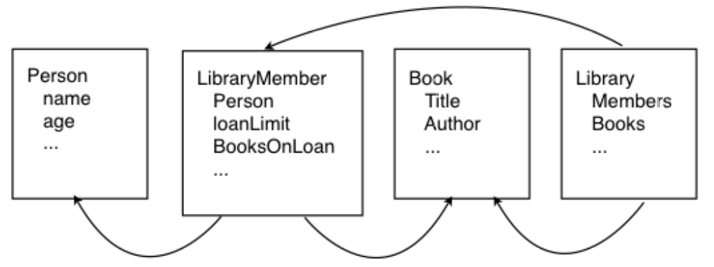

#Introduction to Programming

##Practical 5: Modelling with Lists

###Level 1: Designing a Person

One of the advantages of objects is the ability to encapsulate data specific to
that object and then reuse it in multiple places. A good example of this is an
object representing a person that can be used in many applications. Design a
_Person_ class that could be used by many applications, thinking about the
properties that are common to a person regardless of the application.
When you are happy with your model, you can implement it, including fields, constructor, get and set methods.

__Info:__ There are some special method signatures associated with all classes
created in Java that we can write code for. One of these is a method to return
a _String_ describing the current state of the object. The method signature for
this is:

```java
public String toString()
```

Like the constructor, this method is called automatically for us. In this case,
the method is called when we want to print out an instance of the class. This
method returns the _String_ that should describe the current state of the object.
For example, if we had an instance of class _Person_ called `fred`, when we do

```java
System.out.println(fred)
```

we want it to give something meaningful, such as their name and age. To do
this, the `toString` method might look something like:

```java
public String toString(){
 return "My name is " + name + " and I am " + age +
"years old." ;
}
```

Add a `toString` method for your _Person_ class.

###Level 2: Modelling an application

Select one of the applications below to link your Person into. An example of a
possible class structure for the library application is shown below.



When you have written your model, draw out the class diagrams to show how
they link together. All of these applications will require the use of lists.

1. __Bank__ A bank has many accounts, each of which are associated with a
person. The accounts should each have a unique account number, and
remember a list of transactions. The transactions should contain details about
the time and date, the amount of money, and the type of transaction, e.g.
withdrawing or transferring money to another account.

2. __Library__ Libraries have lots of books, and increasingly DVDs. They have a
list of members that are associated with a person and each member has a
limit on how many items they can borrow, along with a record of what they
currently have out on loan and possibly their loan history. They should be able
to print out due dates for each member.

3. __Restaurant__ A restaurant will have a menu of items that people can order,
along with tables around which people are sat. Each table will have orders
associated with it and should be able to print a bill of all the items ordered and
give the total cost. The items on the menu each have a price, description,
whether they are vegetarian/ spicy and how much they cost.

You should now be able to implement your model for each of the
classes required using the _ArrayList_ data type.
Remember, the `java.util.ArrayList` class needs to be imported
to make use of _ArrayList_. A new _ArrayList_ can then be defined using:

```java
ArrayList<String> listname = new ArrayList<String>();
```

Where _String_ can be replaced with any _Object_ data type. Some useful
methods that can be applied to lists are:

* `size()`
* `add(object)`
* `get(int index)` 

Details on these methods and others can be found on the Java API at:
<http://java.sun.com/javase/7/docs/api/>

Use the `for` loop to write a method to print out all of the people used in your model (e.g. all the customers in the bank).

###Level 3 - Extreme Lists

The data type for the list defined above is `ArrayList<String>`

 Using this
as the data type in another list means that we can have nested lists. One
possible use for this is to define a Grid data type.
A grid structure is useful in many applications. Implement a _Grid_ class that
allows you to create a square grid (containing Strings). Your grid class should include functionality to add a value into a specified position in the grid, access the String at specified
coordinates and to print out the contents of the grid. An example print out
could be represented as follows:

```
[1][2][3]
[4][5][6]
[7][8][9]
```